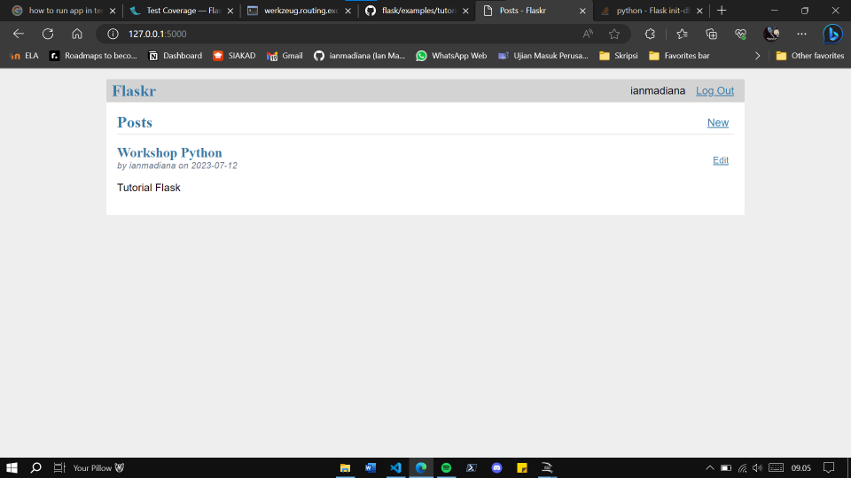

# 11. Pemrograman Web
## Flask
Flask adalah sebuah framework web yang ringan dan fleksibel untuk bahasa pemrograman Python. Dikembangkan oleh Armin Ronacher, Flask dirancang untuk menjadi sederhana dan mudah dipahami, sambil tetap memberikan fleksibilitas dan skalabilitas yang memadai untuk membangun aplikasi web. Fitur utama Flask meliputi:
1.  Routing: Flask memungkinkan untuk mendefinisikan rute-rute URL dan menghubungkannya dengan fungsi atau tampilan yang akan dieksekusi saat rute tersebut diakses.
2.  Pengolahan Template: Flask menggunakan template engine Jinja2 yang kuat untuk menghasilkan tampilan dinamis berdasarkan data yang dinamis dari aplikasi.
3.  Integrasi dengan berbagai alat dan library: Flask berintegrasi dengan baik dengan alat-alat dan library populer seperti SQLAlchemy (untuk mengakses database), WTForms (untuk validasi formulir), dan masih banyak lagi.
4.  Pengembangan Berbasis Blueprint: Flask memanfaatkan konsep Blueprint, yang memungkinkan Anda mengorganisir aplikasi  menjadi bagian-bagian modular yang dapat diatur dengan independen, seperti modul otentikasi, modul admin, dll.
5.  Pengujian: Flask menyediakan dukungan yang baik untuk pengujian otomatis aplikasi web, dengan bantuan pustaka pengujian seperti unittest atau pytest.

Flask dapat digunakan untuk membuat berbagai jenis aplikasi web, mulai dari proyek kecil hingga proyek yang lebih kompleks. Kelebihan Flask terletak pada fleksibilitasnya, yang memungkinkan pengembang untuk memilih dan mengintegrasikan alat dan library yang sesuai dengan kebutuhan proyek mereka. Dengan pendekatan yang sederhana dan dokumentasi yang baik, Flask menjadi pilihan yang populer bagi pengembang Python untuk membangun aplikasi web yang efisien dan skalabel.

